内容有点多，可以先看目录挑感兴趣的看

1. **请先验证你掌握的事实信息**
2. **你的论点是否有事实支撑**

> **我们应该也必须从实证角度出发，去讨论事件，而不是基于自身信念，或零散甚至虚假的信息去讨论事件，事实和实证是基础。**

## 我谈下 pm 事件 - 事件发展阶段（注意保证自己独立思考，有疑问请向我提出质疑）

先划分整个事件的阶段 - 按gf下场前后，整个事件是被分为几个阶段的：

### 前期（事件爆发）

### **--- 舆论立场及其对应的网络暴力**

死者家属（猫姐猫妹）打开并引导舆论，同时引起多方面舆论：

此时舆论的排序（按数量级）：

1. 抨击捞女和 PUA，共情胖猫 -- **网暴 tz** 
2. 观望与吃瓜
3. 空包事件 -- **网暴商家**
4. 洗白 TZ 的人
5. 认为正常恋爱，男玻璃心的人
6. **本身就是捞女**的群体 -- 它们为了自身利益不被波及，会**网暴猫姐，甚至造谣**
7. 打假，抨击猫姐意图不轨、博眼球 -- **网暴猫姐**
8. **造谣群体、人血馒头群体 --- 哪里有流量，就去网暴谁，甚至造谣**

**注意，以上群体不是单一分类，彼此独立，一个人可以属于以上多个群体（多标签分类）**

**====**

### **--- 网暴与谣言**

主要分为：

1. **虚假事实，恶意脑补，不经验证传播论点**，例如 TZ 道歉视频、伪造聊天记录、胖猫没死、某某人实锤等等
2. **涉恐言论（同时也是虚假事实）**，例如 TZ 被打、通缉悬赏 TZ 等等

====

### **--- 辟谣与实证**

此时死者家属虽然是可以辟谣的，但是**没有官方背书，辟谣存在难度**

- 比如胖猫没死，只有**火化证、甚至救援队出面才能辟谣**

而面对铺天盖地的舆论，tz 承受的网暴和谣言**是最多的**（**请注意，猫姐没有造谣，是哪些吃人血馒头的在造谣**），但是**几乎无法辟谣**，因为**主流舆论场无法容纳 TZ 的声音。**

### 后期（gf 下场介入）

**gf 本该呼吁大家网恋不要大额转账，呼吁大家不要网暴，双方也都能发声，jf 调节下达成互相和解，圆满结局** ---

- 结果 jf 直接把死者家属嘴封上了，并且 TZ 和 PM 正常恋爱
- **胖猫事件，从来就不是死者家属的一言堂，各方舆论都有。。。**

**现在让我们继续逐步分析：**

### **--- 被**激化了的舆论、网暴、谣言

官方的定性是：

1. **正常恋爱、互有往来**
2. **猫姐网暴，网络封杀猫姐**

**我真的想吐槽，GF 应该 -- 呼吁大家网恋不要大额转账，呼吁大家不要网暴，双方也都能发声，jf 调节下达成互相和解，圆满结局，多好啊。。。**

结果搞这个，大家知道意味什么吗 -- 

1. **死者家属无法出面辟谣**
2. **捞女群体或者洗白 TZ 群体得到官方背书，开始狂欢**
3. **打假群体，开始狂欢**
4. **造谣群体看到家属无法出面辟谣，可以开始 - 传播谣言，或者传播部分事实的误导-错误信息**

**此时这些舆论得到 gf 支持，开始上升：**

1. 洗白 TZ 的人
2. 认为正常恋爱，男玻璃心的人
3. 本身就是捞女的群体
4. 打假，抨击猫姐意图不轨、博眼球
5. 造谣群体、人血馒头群体

必须承认，**gf 控制舆论和网暴失败，甚至反而激化了舆论和网暴，甚至激化了谣言（家属无法出面辟谣）**

### **--- 有人去辟谣与实证的必要性**

**所以需要有人出面，对整个事件进行一些辟谣和实证，避免舆论走向谣言**（等 gf 发声，，可能事件都结束了，而且 gf 大概率只会模糊处理与降温处理）

目前的主要工作不再是发表观点，而是**整理大家的信息与观点**，**打破信息茧房和局部视角，最重要的是打破谣言**

信息来源主要是**我的评论区、我看到的网友论证、网友们收集到的信息**，欢迎大家提供信息**（比如你的观点、你看到的好文章、你所收集到的信息）**

## 5月26 - 胖猫死前两天内的活动 最全梳理

【胖猫跳江那晚，谭竹还想让胖猫承担花店亏损-哔哩哔哩】 https://b23.tv/34asA9I

## 大佬的论证（给大佬排面，放在最前面了）

- **很深刻的论证1（错误信息传播论）**：来自 [@思辩](https://www.zhihu.com/people/f2a002f930f4723365feaf85802e7b89) 大佬，通报舆论的影响 - **错误信息**诸如“胖猫事件反转了”“谭竹没有捞胖猫钱”等被传播，但是无人警告、提醒（**章XX视频下架等**）导致错误的信念被广泛传播（达到**曼德拉效应、岁月史书**等类似的效果），进而为TZ洗白打基础（已经造成了很好的洗白效果…），大佬很强，文章有相关研究佐证，**参考链接**：https://www.zhihu.com/question/656634762/answer/3506601416?utm_psn=1776689201889095682
- 思辩大佬太强了，，这个也写的很好，实际上大佬的每个文章都写的很有道理：https://www.zhihu.com/question/656579683/answer/3506308152?utm_psn=1776693326680834048
- 总之，警惕岁月史书，我突然想起来猫**死前还给他的妹妹打赏直播**，，被错误信息影响导致我以为胖猫家庭环境很不好，已经绝交了，，**错误记忆造成的持续影响真的会改变我的思想（不过目前主要是整理八方信息、百家观点，不进行站队)**

## 当前猫姐（甚至无辜者）遭受网暴和造谣的节奏，如何破局？

### 参考 思辩 大佬的回答：拆桥

参考 [@思辩](https://www.zhihu.com/people/f2a002f930f4723365feaf85802e7b89) 大佬的 [如何看待山大威海校区大阪烧老板因为发表同情胖猫的言论被某群体攻击致停业? - 知乎](https://www.zhihu.com/question/656835468/answer/3508173833)

简言之就是，豆瓣小组的同质化程度非常高，而微博平台则存在大量相关群体及机器人，在“过滤气泡理论”的连接下，不同平台间的回声室效应可能会相互加强，导致网络暴力行为的发生。

而减少这类网暴的办法，主要包括切断连接不同平台之间的桥梁（**封禁尽可能多的相关帐号**），以及外部裁判的适当介入（**估计是不可能的，，**），以控制回声室效应的强度。

## 5月23 - 辟谣参考（这个辟谣失效了，人死就下失信）：pm 没有成为失信被执行人，仅是被执行人

### 参考 1 

**参考** [@HenryVI](https://www.zhihu.com/people/96b5e05a8292fd291a43f8d7c498058d)：[所谓胖猫被母亲坑，成为失信被执行人的真实情况（详细可查） - 知乎 (zhihu.com)](https://zhuanlan.zhihu.com/p/699092335)

按 [@HenryVI](https://www.zhihu.com/people/96b5e05a8292fd291a43f8d7c498058d) 的信息

1. pm被执行，但是**偿还了、结案了，**并不是失信被执行人，仅仅是被执行人
2. 案由：民间借贷纠纷、债权人撤销权纠纷
3. 时间线：2020 - 2022 年

相关文书：

- 阳东香、刘杰等债权人撤销权纠纷民事一审民事裁定书 - [文书全文](https://wenshu.court.gov.cn/website/wenshu/181107ANFZ0BXSK4/index.html?docId=y8aBPW+o2P76Goa7tVoZ+nxIP5gxaFO8PTdgUmlh0yAZNZBCctxo0WI3IS1ZgB82CbOP+Ej3t0GD6LQ7ng5tkOarqJAxfO3lG+br+Y+CE4BNST9ez55+znxg8tUThJ5I)
- 阳东香、石建英等民间借贷纠纷民事一审民事判决书 - [文书全文](https://wenshu.court.gov.cn/website/wenshu/181107ANFZ0BXSK4/index.html?docId=43JN2gLEV9jKub+D6e7wzWfhN/p1b+w5U33x5YZV0xd7bhlIztPG7GI3IS1ZgB82CbOP+Ej3t0GD6LQ7ng5tkOarqJAxfO3lG+br+Y+CE4BNST9ez55+zswx+Ld8Zp4B)

内容：

- 2020年作为连带担保责任，和父母一起还债：
- 一、被告石建英偿还原告借款本金219000元；二、被告石建英偿还原告借款本金219000元为基数按照月利率1.28%，利息56260元，从借款之日起清偿至还本清息之日止
- 2022年和阳某某达成庭下和解

按评论区提供的参考信息原文：

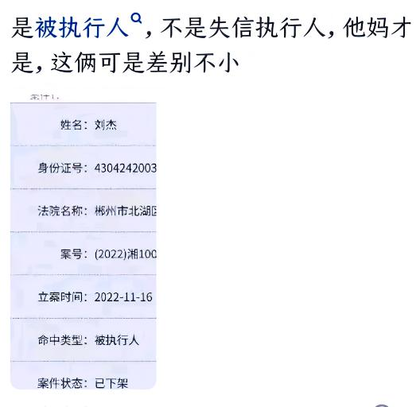

我搜集到的结案裁定书（**庭外和解，撤销执行申请**）：

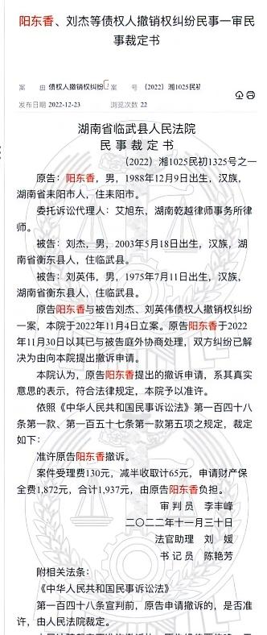

### 参考 2 wb 上某人的辟谣

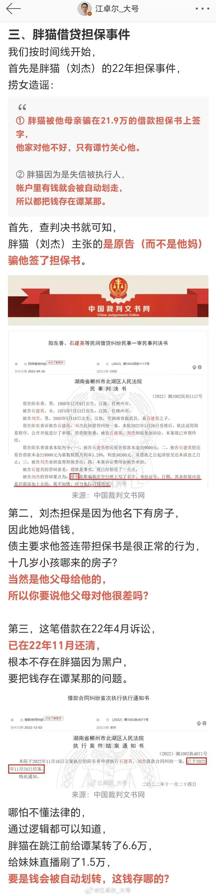

## 5月25 - 辟谣：无法查明 pm 存在房产

### 1. 裁决文书中 pm 没有被查封过房产

虽然 pm 做其母亲担保人一次（被告刘杰的答辩要点为：原告是欺骗我在空白纸上写了名字、身份证号、日期，其余担保内容是后面添加上去的，我不知情。应当免除担保责任。）

但是并没有说明是否抵押了房产之类的

所以**无法从裁决文书中判断 pm 被抵押过、查封过、存在有房产**

注意，**其父 刘英伟 被查封了一套房产** - 期限 3 年

- **这是“pm 有房产（被查封房产）的谣言的来源”**

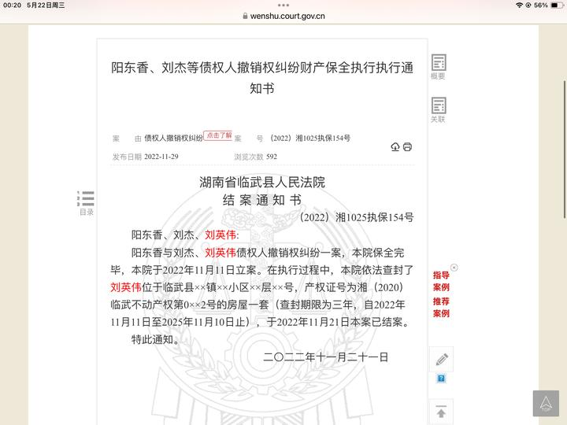

其父亲刘英伟被查封过房产，期限 3 年

**如果有渠道可以知道 pm 是否有房产，请联系我；**

## 5月25 - 实证：文书中 pm 相关的贷款案子均结案

第一个案子：（2022）湘1002民初1117号

这个案子明确是 pm 担保，猫妈被告。

第二个案子：（2022）湘1002民初1325号

这个案子被告是 pm 和猫爸，不是猫妈，**这意味着这可能是第二个涉及胖猫的债务**。

### 第一个案子的一审判决和结案通知

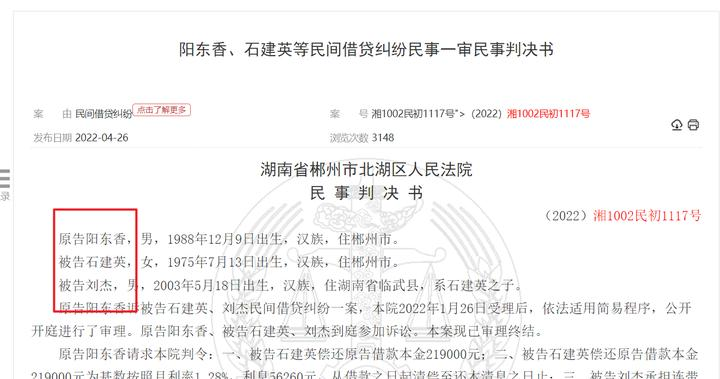

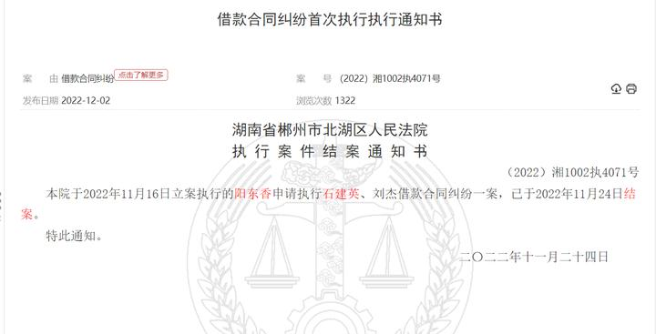

### 第二个案子的一审判决和结案通知

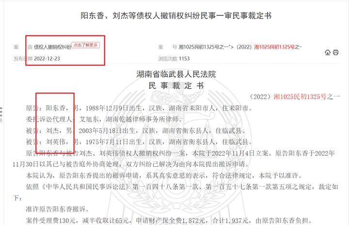

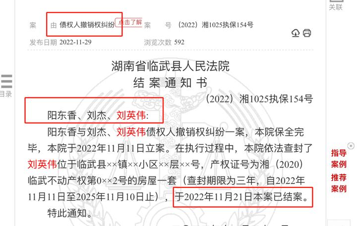

**pm 和他爸、他妈的案子，貌似都结案了，如果有问题，请联系我**

## 5月23 - 动手辟谣（这个辟谣失效了，人死就下失信）：上 http://zxgk.court.gov.cn/ 实际搜下失信和限高

首先看一下案号是哪个：

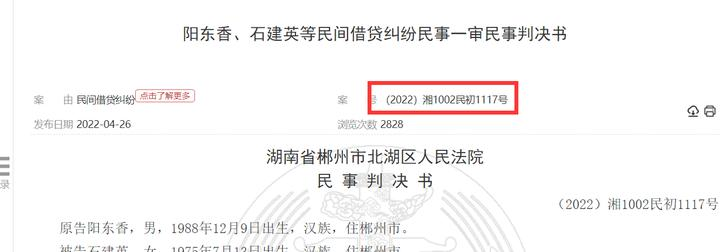

案号（2022）湘1002民初1117号

接下来，咱们围绕案号去搜索：

### 是否是失信被执行人 - 案号（2022）湘1002民初1117号

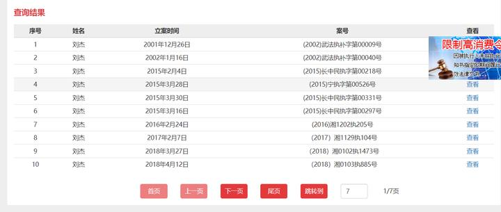

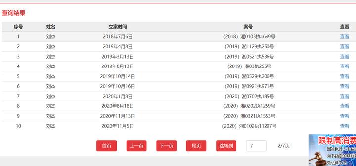

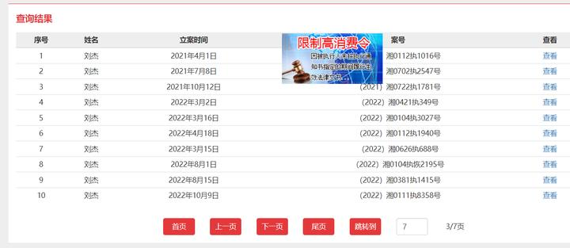

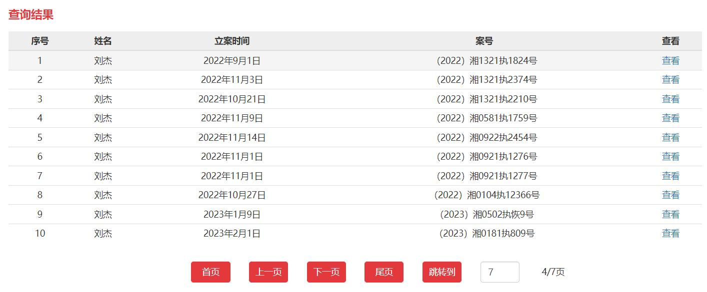

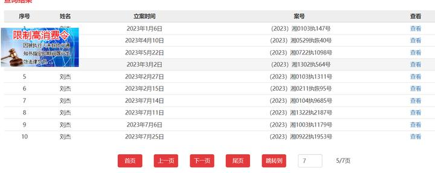

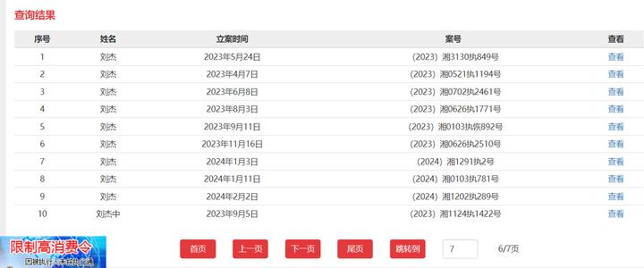

### 是否被限制高消费 - 案号（2022）湘1002民初1117号

首先看看案子的法院：

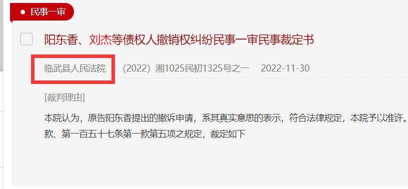

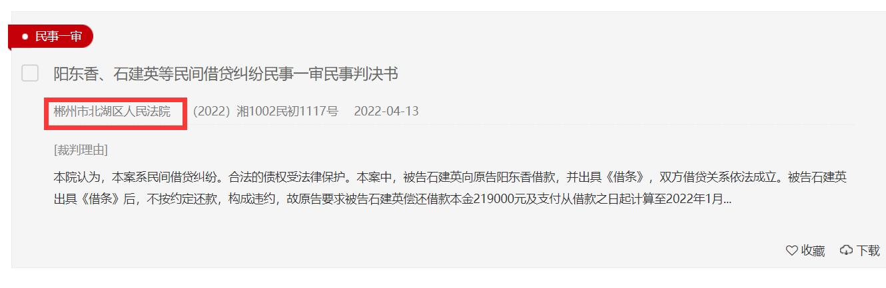

1. 临武县人民法院
2. 北湖区人民法院

（为啥不直接搜湖南省，，因为38页太多了，咱们只搜裁决案子的法院就行）

然后开始搜索，之后比对案号，发现都对不上

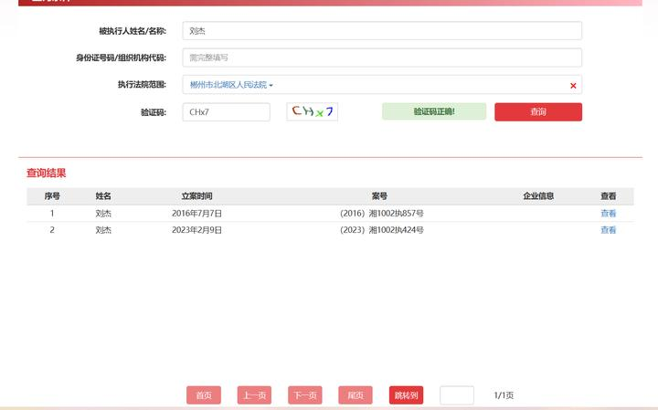

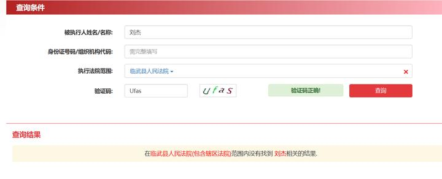

### 结论（这个辟谣失效了，人死就下失信）：失信或限高，都是造谣（累死我了，，这网站太卡，）

## 5月24 - 辟谣：我们无法证实 pm 失信与否，除非警方和法院发声。

失信被执行人的自然人死亡，会从失信名单中下来

参考：

[已过世的人是否会被纳入失信被执行人名单?](https://www.zhihu.com/question/397285638/answer/1257719020)

当我们能确定的事实：

### 可确定事实 1 - pm 两个裁决都是结案

### 可确定事实 2 - pm 的支付宝微信都是 可以正常使用的，可以存 数万元

### 可确定事实 3 - pm 姐姐为了防止 tz 拿钱，把钱转入 pm 银行卡，银行卡可以使用

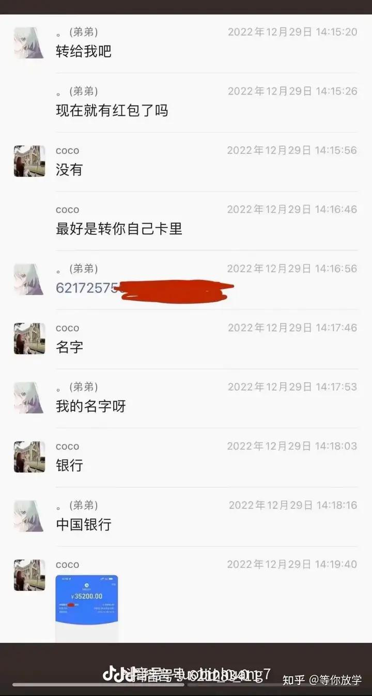

借弟弟 3w，返还35200

## pm 家庭负债的信息 - 其母亲是 失信人，多起负债 - 来自评论区

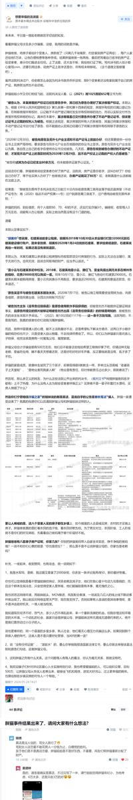

### 证伪家庭吸血论：应通过钱的流向 去证实或证伪 家庭吸血论

首先现在情况，**无法判断 pm 生前是否是失信人**。

我们只能得知，**pm 的两个裁决都是结案。**

而是猫是否是失信人，除非警察下场，否则不可能确定。

我相信，大家是承认我这个说法。

简而言之，现在情况是，**猫的家人有债务。**

我们先说一个前提，先不管是不是失信人，我们都可以**想像（假设）**：

-- **胖猫帮爸妈还钱的情景** --

而且 **在这个假设前提下，可以推得，爸妈吸血**

但是请注意：

- 猫这两年以单局20-25元代练，能给女朋友转账43万，这说明什么？**说明全部的钱都给谭竹了**
- 你把所有钱都给谭竹了，你怎么帮爸妈还债？说明**这个假设前提不存在**，那么爸妈吸血这个结论就是不存在的。

也就是如果不满足，猫给其父母转大量钱财，就可以证明，胖猫没有被吸血，而不是通过其父母是否失信、欠债来证明 ....

我相信大家都是有独立思考能力的人，**我们的家长如果欠债，就一定会吸我们的血吗？更关键的不是家长欠债，而是 胖猫把钱花给谁 ---** 

**钱的流向才是证据。**

我想说，有的人会利用一些 **假设的前提去误导** 群众，**很多信息不是错误的，而且很正确，但是有可能存在想象、猜测、假设**，基于这种思想上的前提，**并不能得到真实的答案。**

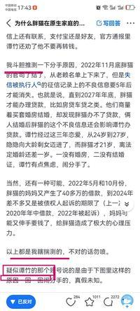

假设前提，全靠猜测....

## 心理动机分析：为什么猫姐要网暴TZ、警方为什么这么处理？（5月24凌晨）

### 人心是第一主观能动性

当我们分析一个人的行为时候，是要从客观事实入手，还是从心理入手？答案是人心，下面具体聊一聊：

### 猫姐对弟弟的诉求 - （前提：姐弟情深）

回到事发当天的场景：

你有一个弟弟，你很爱他，他自s了。

而你看到他手机里面，女的一直在要钱，而你弟弟几万几万的转，自己却吃着 10 块钱的拼好饭；奔现之后却自己住着出租屋，

连头像都是“我不要吃菜，我要吃麦当劳”

姐姐会怎么想？你们会怎么想？姐姐和我们都一样，那就是 TZ 对弟弟不好，尤其是死前分手…

姐姐会接受吗？怎么可能接受，，

我们现在谈论 pm 、猫姐、tz，是在一个理性视角下，但是猫姐当时的情境下，你告诉我能理智？要求当事人绝对理智，是否过于理想主义了，对于成人后四海为家的兄弟姐妹，弟弟很久没见，在看到这些聊天记录，尤其死前分手，**证据都指向 TZ**，此时猫姐只会是两个字，报仇。

当然，一切前提是，姐弟之间感情很深。

### 猫姐对 TZ 的诉求 - 不可原谅和和解，判 TZ 坐牢（和通告相吻合）

通告里说了一句：“**不好过，付出代价**”

如果你是姐姐，想要讨一个公道，要去判一个人的罪，方法就两种：

1. 报警、起诉
2. 直接舆论审判，网暴

可这个弟弟，，，很爱那个人，转账都是520、1314、9999，甚至最后死前还备注自愿赠与，，警方怎么看？

姐姐对于相信警察而言，更倾向于网暴，网暴是当时情景下的主观最优解。

那么报复的目的是什么？

1. 钱
2. 审判

猫爱TZ，这聊天记录和恋爱时长，而且俩人还奔现了，不是纯网恋，让警方怎么想？电信诈骗吗…

- 注意，如果纯网恋，**猫姐会直接说 tz 是诈骗犯，而不是说 tz 是捞女**

警方只会按正常恋爱判，最多让 TZ 退钱了事；而事实也是，TZ 退钱了事，

对猫姐，钱是目的吗？如果目的是钱，**警方就不会等猫姐 不予立案 申诉有效期 7 天过了，再发通告，直接一手交钱、一手结案不香吗？**

**猫姐的诉求就是审判。**

而且是**道和法都要审判**，在法律审判前，道德也要审判，那就是网暴，

### 猫姐动机 和 警方通告的吻合点

1. 通告写明要让 TZ 付出代价
2. 过了不予立案申诉的有效期才发通告，就是**警方表达彻底不予立案的意思**。

警方也是为了保护 TZ 不被网暴。

### 警方视角：疑罪从无，并且 很难定性 是否 猫自己想不开，并且 不能放纵猫姐网暴

对于猫，很难定性，自杀这种事情，不处对象也有可能想不开，在警方视角和猫姐就截然不同；

因此警方更支持**疑罪从无，聊天记录毕竟是信息维度低的证据，如果能有视频、音频这些证据会比聊天记录更有价值。**

而在警方看来，猫姐引导的网暴审判，是对网暴的纵容、对于网暴管理和社会稳定造成负面影响，**所以更加不能为猫姐说话。**

**因此，猫姐目前被制裁。**

### **问题出现：警方没有停止反而助长网暴与造谣，原因是什么？**

这个不好多说了，可以思考一下啊。。。

## 5月24上午 - 聊天记录分析

这个聊天记录很多，自行分析吧，主要说几点：

### 分析要点（请自行分析，因为聊天记录太多了）

1. 猫的钱花给家属还是TZ - 这很重要，别说什么家属吸血，实际地看看钱去哪里了；
2. 通报中所说 TZ 让猫存钱，是 PUA 手段，还是真让猫存钱？
3. 猫死前的行为很重要，**因为要分析一个人死亡的原因，“死前”一定是所有线索中最重要的**

### **通报中的断章取义聊天记录 - “你还小，你也是要用钱的，...”**

这个不太好评价，但我感觉这个真洗不动了....

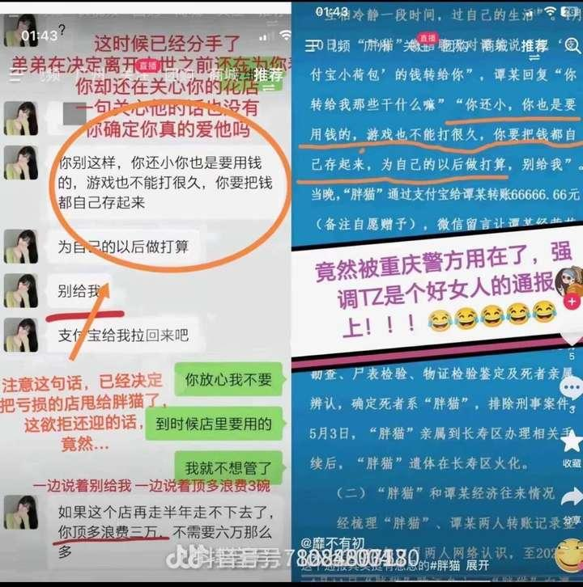

## 5月23 - 辟谣：为什么有人认为猫原生家庭不好？

因为他们认为，猫的死**不是因为分手**，而是因为**不断给原生家庭吸血**。。。

而这个理论，它的前提就是**原生家庭背负巨额债务**。。。

而我们实际也看到了，胖猫并不是失信人和限高，并且胖猫能在两年赚79万，他会差20万的债务吗？这个谣言真的很离谱。。。

## 5月23 - 证伪原生家庭不好，反而证实 TZ 捞女身份

为什么说原生家庭不好这个理论证伪后，会坐实TZ分手害死猫？

因为死前的转账。如果**你原生家庭没管你要钱，你也没背负什么巨额债务。。。你告诉我之前是怕原生家庭追回？？？**

就是不想分手，才转钱，，，而且为什么转钱，因为TZ只会要钱。你猫哥已经看清楚TZ是个什么人物了，给钱 TZ 才会靠近猫。我们对捞女的定义，不就是靠钱维系的关系吗…咋的，捞女不要钱是吧？捞女不要钱就不叫捞女了，尤其是胖猫这种已经被拿捏的，TZ 不需要去过度迎合胖猫了

（有人说 **捞女很精明，那是分人的，你已经是我的舔狗了，我为什么要对你精明？**）

## 捞女的定义（关于什么是捞女，网上争议很大）

捞女的定义其实很简单，就是要钱

但是，要钱他是一门学问，你是舔狗的话，我直接要钱就可以。你如果是一个普通朋友，那我就要用美色诱惑你，你才能拿钱。

如果你是一个很有钱有能力的舔狗（比如通天带），那我跟你玩一玩也不是不可以。当然疫情之后你们奔现。。。。奔现之后发现和帅t没法比，好了，我不想要你了，老老实实在出租屋里呆着。有钱给我花，我去找帅t找女t，有钱的舔狗真好…对了，我没事，我还要催促你赶紧工作 这样我才能有更多的钱花，你看我花店多好（只写了自己名字），**挣钱是我的，赔钱是你的**…事实是聊天记录也是体现了这样的思想，（**我记得有个截图，他们俩聊天，关于员工亏损**）

此外，胖猫不断掏钱给 TZ 并非是其本意，而是 **TZ 不断 PUA、驯化并且主动要钱** 导致的（参考相关聊天记录）

### 注意，对我的观点请保持理智态度，进行验证或者向我提出质疑，而不是我说什么你就信什么，请独立思考！

## 5月22日下午

- **更新1：**目前已经更倾向于猫姐猫妹并没有对猫不好，他们之间关系不错，见更新

### 有较多组织网暴猫姐的情况 - 信息

- **参考1**：有人总结了关于网暴的情况，实际上**有较多组织网暴猫姐的情况 - 参考(** [@不存在的](https://www.zhihu.com/people/83b06f882af960f411e57e72e1b4789e) **)：**https://www.zhihu.com/question/656574429/answer/3506304172?utm_psn=1776645699759210498

### 猫姐组织网暴 TZ 的手段 - 信息

- **参考2：**猫姐组织煽动网暴的方式是：**视频上了抖加（100多元）（有待具体证据证实） - 参考(** [@大侠饶命](https://www.zhihu.com/people/793d3d38f0ccb45b28d5cbe1ea0f7ab6) )：https://www.zhihu.com/question/656574429/answer/3506220004?utm_psn=1776649854259200000

### 全员恶人论 - 信息

- **参考3 - 作者系补档**：pm事件中**全员恶人论（原回答中我也是这样思考的，但目前思路是，重在整理信息，而不是定论）**的多个观点、分析、聊天记录等参考信息 - **参考(**[@啦啦啦啦](https://www.zhihu.com/people/0bb13a8b1c7a4db92aabd3510630f8a9)**) - 补档：**https://www.zhihu.com/question/656574429/answer/3505213980?utm_psn=1776654458002845696

## 5月22日晚间

### tz 不是捞女的论证

- **论证1 - 评论区提供：**tz不是捞女的论证（来自本回答的评论区）

1. pm和tz奔现，而不是纯网恋，不像捞女行为
2. tz没有脚踩多只船
3. 共同经营花店，不像捞女行为

参考原文：

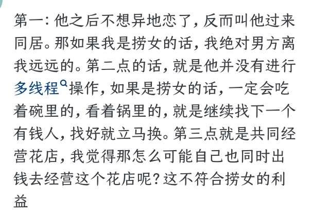

## 5月23号早晨

### tz 存在 PUA 行为的论证

- **参考1 - 私信征集：**

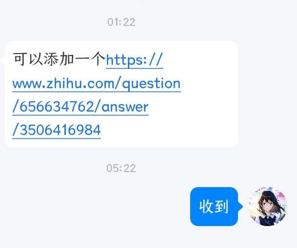

原文预览：

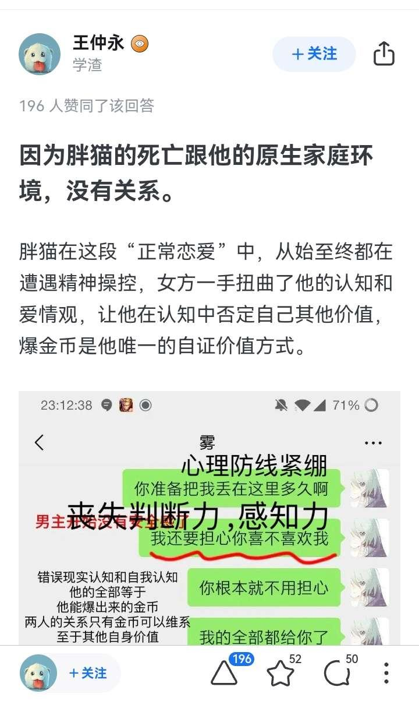

来自网友的私信，这个是**关于TZ存在PUA行为的论证，论据主要是聊天记录的PUA话术解析，下面是参考原文：**https://www.zhihu.com/question/656634762/answer/3506416984?utm_psn=1776851441736998912

### 通报的异常点的论证（通告时间、通告内容、通报后针对猫姐网暴及舆论）

参考 [@liosummary](https://www.zhihu.com/people/973075d9d6fe0d9c4cedb1515e5f5296) 的回答：[胖猫事件结果出来了，请问大家有什么想法? - 知乎](https://www.zhihu.com/question/656496711/answer/3506591577?utm_psn=1776924223913013248)

**通告时间的疑点**

在5月11日出具不予立案决定书后，为何在5月19日才发布通告，这中间的8天时间是否存在问题？

1. JF 是否有意延迟发布通告，以及这**是否与猫姐申请复议有关**

- 根据《刑事诉讼法》第一百七十一条的规定，控告人对不予立案决定不服的，可以在收到决定书后七日内申请复议，警方应在三日内作出决定
- 但是 JF 没有这么做。。。

1. **背刺猫姐、封杀猫姐后再引导网暴猫姐**：这里引用作者[@liosummary](https://www.zhihu.com/people/973075d9d6fe0d9c4cedb1515e5f5296) 原文：

> 明明三方都已经达成默契了，和解、官宣、降热度、消除影响了，胖猫姐姐也认可不予立案决定并感谢重庆公安了，为何警方要在通报里面背刺胖猫姐姐？不予立案我们能够理解，但为什么要来引导另一场网暴？

**通告内容的疑点**

1. **通告内容混乱**：时间线描述混乱，转账描述混乱
2. 倾向性、春秋笔法

**通报后针对猫姐网暴及舆论**

这个不用多说，看在眼里，**而且猫姐直接被封杀了**，通告带了一波更大的网暴节奏…而且**通报之后误导、错误信息、谣言不断传播**，而一些如章等人的视频或文章也被禁了，导致传谣的网友不能被及时提醒、意识到错误信息…

当然网友出于朴素的正义感，平安cq 号，也被每小时数十万的评论冲刷（加班删评论，，）

## 原回答 - 被谣言迷惑（猫姐捞钱还债，全员恶人论）

真的全员恶人吗…感觉猫没有人可以相信和依靠…

谭竹：

看猫老实还能赚钱，主动勾引猫，然后**吊着胖猫，一个棒子一个甜枣**

**给猫希望（花店、结婚）**

**同时捞钱心安理得（520我要9999、20000秒花光、我已经把存款转定期，以后专心花老公的、乳腺癌疫苗、自己去旅游实际带个女T）**

钱都给tz了，天天吃拼好饭，到底是为了防止钱给家人，还是tz花销真的太大（捞）？怎么忍心的…每天少转一点钱，是不是自己就能吃点好的………

**最后一点：猫哥刚成年就顶债了，并且到死都没有给父母钱，如果TZ真的爱胖猫的话，怎么会客客气气把钱给pm的父母，这绝对不会是胖猫生前遗愿，而且如果我是TZ也绝对不会这么做，在pm替父母顶债的前提下，这样做根本就是对自己不利的一件事情，只会带来不好的舆论…**

**此外还有一个很离谱的，就是TZ给pm父亲钱之后说的话：**

**“双方就刘杰与谭竹交往期间的经济问题再无纠纷。这个也要哦叔叔”**

猫姐及猫家人：

**活着不关心胖猫**，猫死了，想着靠网暴把猫的钱捞回来（**猫月薪两三万，不能便宜了谭竹，而且还有替他妈妈做失信执行人、欠了20多w**）

**现在我就觉得胖猫家人把这些钱拿回来就是给他们自己还债的…丑恶的嘴脸…**

官方处理的好，通告也写的好，很有水平，大家都 **皆乐欢喜**，，是这样的，**加班删评论**…

最后做个总结吧

生前被父母骗、被女朋友骗

死后还要被外卖骗、被姐姐骗、被吃人血馒头、被当做流量韭菜…

我认为，哪怕有一丝希望，哪怕有一个人可以依靠…

他都不会去死。

## 5月22号下午

### 后续将持续关注

看了一些网友的讨论和一些视频，感觉其实猫姐没有错，这部分还需要**更多的参考信息、讨论论证，**我会持续关注和参考大家的讨论

### 猫姐猫妹和猫关系应该还不错

新的参考信息和观点：

确实，煽动网暴报仇，“让TZ付出代价”，这其实属于一种朴素的观念：报仇（报仇一定情况下确实非法律和规则所允许）

如果能证明猫姐猫妹的行为与pm父母的债务无关，那么就能说明她们其实没有那么坏（关于TZ的新的信息我也会持续关注）

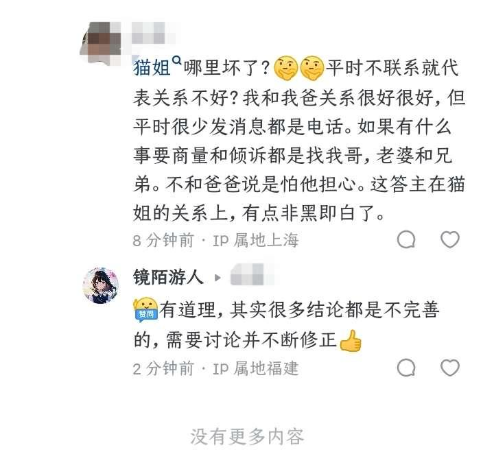

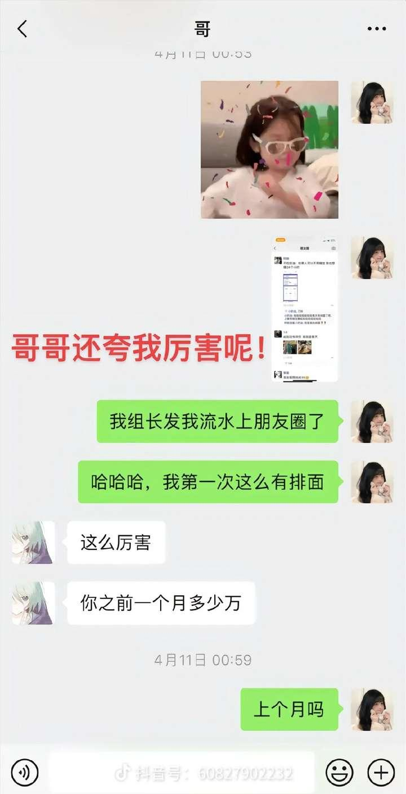

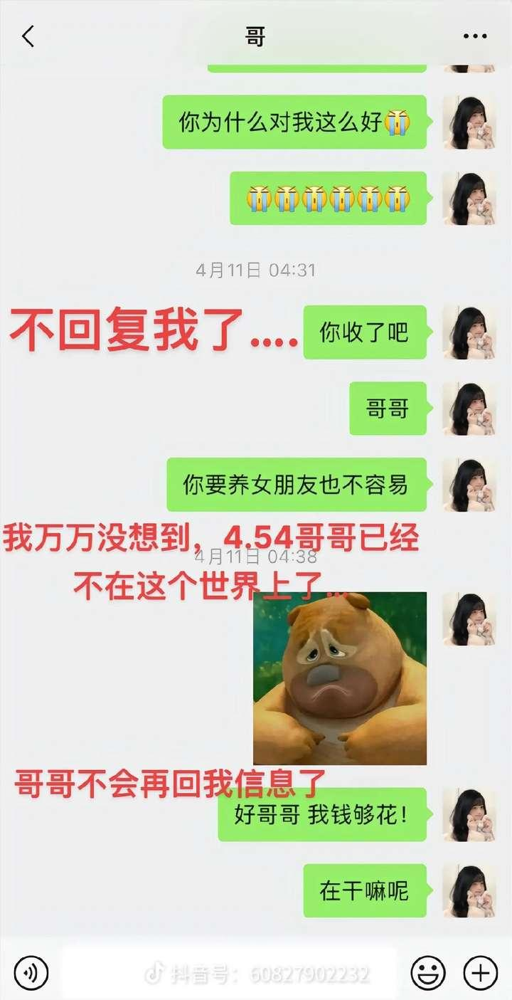

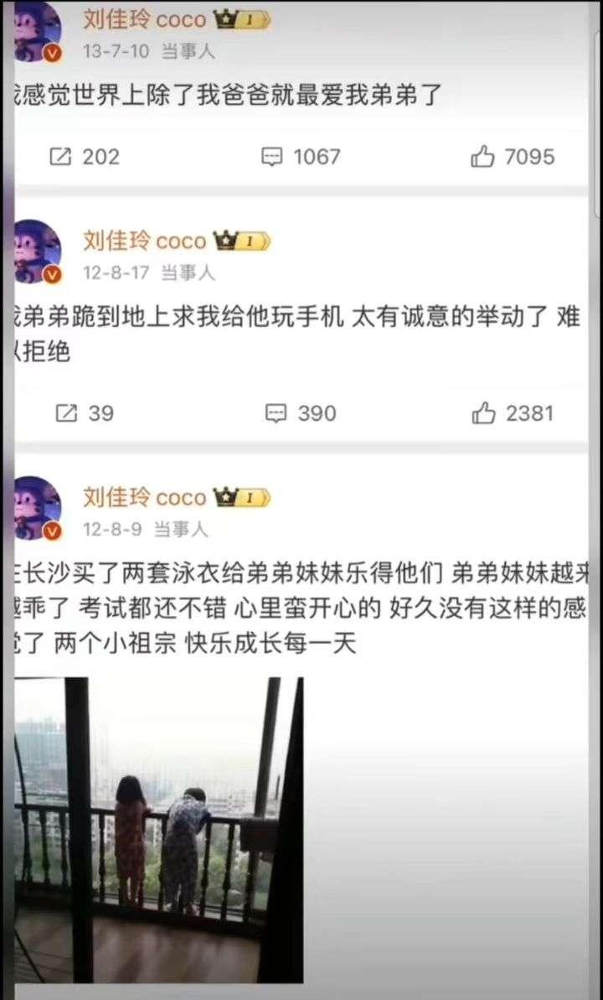

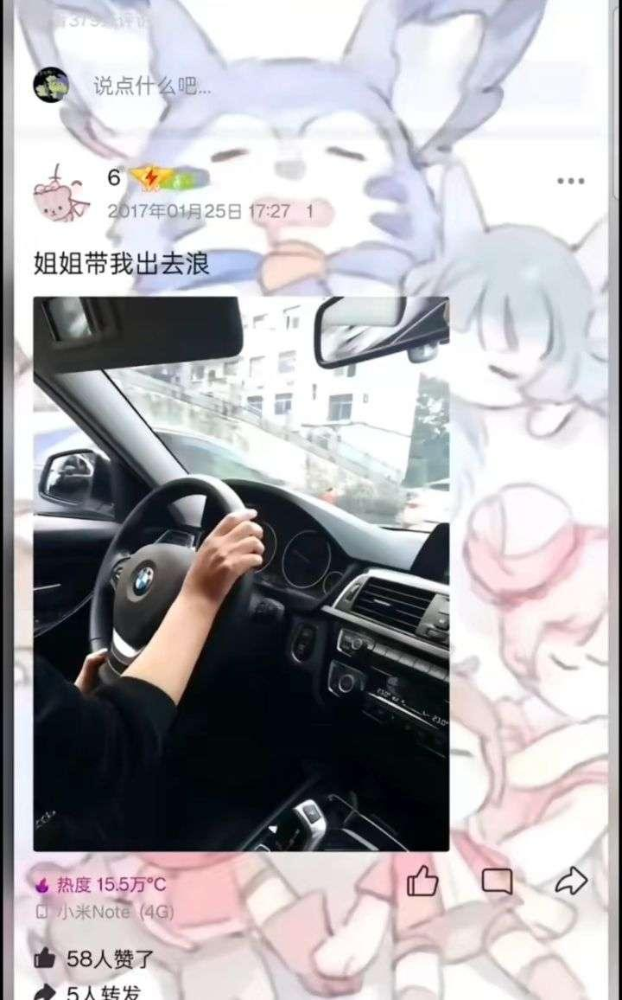

### 猫姐无害论相关讨论

【说胖猫的死是因为姐姐妹妹相逼和原生家庭迫害的，统统给我滚进来！-哔哩哔哩】 https://b23.tv/uDghtJa

### 猫姐被网暴的参考信息

https://www.zhihu.com/question/656574429/answer/3506304172?utm_psn=1776645699759210498